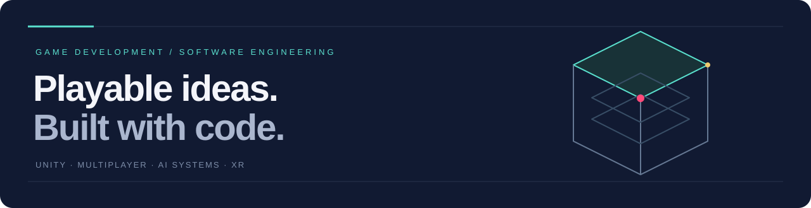

Associate Software Engineer at **MangoMango Games**, building Unity gameplay, multiplayer and mobile systems. I also work on AI-driven game prototypes and AR/VR integrations.

[Portfolio](https://ahsanhere.me) · [LinkedIn](https://www.linkedin.com/in/ahsantariq02/)

### Selected work

| Project | Focus |
| :--- | :--- |
| [THRESHOLD](https://ahsanhere.me/games/threshold-ai-roguelike) | A sci-fi roguelike with an LLM-driven game director. |
| [Over The Top](https://ahsanhere.me/games/over-the-top-grapple-runner) | A Unity physics runner built around grappling and momentum. |
| [BOMBASTIC](https://github.com/Nexonomy/bombastic-sky-riot) | An AI-assisted 3D browser game with connected arena floors and verified rankings. |
| [React Native + Unity Bridge](https://ahsanhere.me/projects/react-native-unity-bridge) | Embedding Unity runtimes in mobile apps with bidirectional messaging. |

### Toolkit

**Gameplay** — Unity, C#, URP, NavMesh, DOTween  
**Multiplayer & mobile** — Photon Fusion, Firebase, React Native, TypeScript  
**XR & AI** — AR Foundation, XR Interaction Toolkit, Python, LLM integration

### Community

Mentor at **GDG on Campus — UMT**; previously the chapter's founding Game Development Lead. Computer Science graduate from UMT Lahore.

Open to game development and software collaborations. [See my work →](https://ahsanhere.me)
